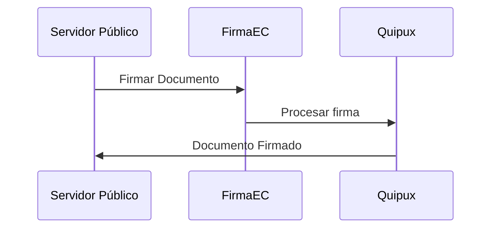

## Descripción
*[Detallar a un nivel apropiado el requerimiento. Describir el rol de quien utilizará la funcionalidad, la necesidad y el beneficio de cumplir con esta necesidad. Ver ejemplo]*

**Como** como servidor público en el Sistema Quipux,
**necesito** poder firmar las oficios,
**para** garantizar la legalidad de los documentos.

## Criterios de aceptación
*[Incluir las validaciones que se espera como mínimo para que el requerimiento se de por aceptado. Ver ejemplo]*

* Se debe mostrar en una nueva pantalla únicamente las atenciones finalizadas.
* Debe permitir firmar una por una o en lote.
* Se envía un correo de confirmación después de ejecutada la transacción.
* .....

*[Se debe adjuntar prototipos de pantallas, ejemplos, flujos de procesos, documentos normativos, etc. en caso de contar con los mismos y siempre que aporten al entendimiento del requerimiento. Ver ejemplo de flujo]*

## Listo para Trabajar (DoR)
*[De utilidad para priorizar el requerimiento (INVEST)]*

* [ ] **I**ndependiente – se puede trabajar sin depender de otros requerimientos
* [ ] **N**egociable – puede ser modificada sin perder su objetivo
* [ ] **V**aliosa – debe agregar valor, el beneficio es claro
* [ ] **E**stimable – se pudo ponderar en la planificación
* [ ] **S**imple – tan pequeña para caber en el sprint
* [ ] **T**esteable – se puede probar, los criterios de aceptación son claros

## Flujo
*[Opcional. Para ayuda consultar la web: [Mermaid](https://mermaidjs.github.io/sequenceDiagram.html)]*
